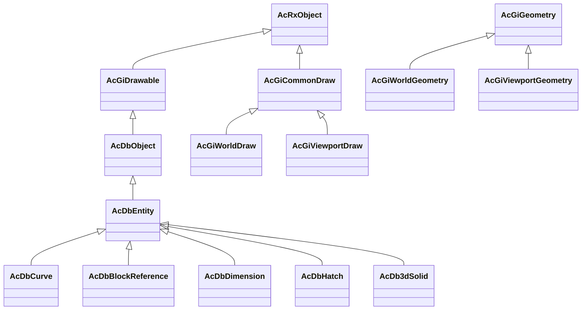
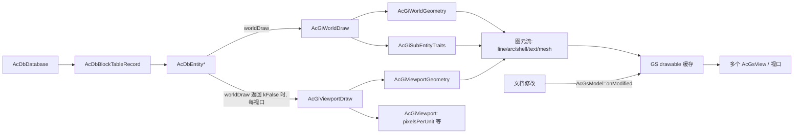

# ObjectARX 渲染协议知识图谱

> 来源：`C:/objectarx2026/docs/arxref`（ObjectARX 2026 参考文档，25,505 个 HTML）。
> 本文抽取与"实体渲染协议"相关的子图，作为 infinite-grid 渲染架构移植决策依据。
> 每个节点的关键结论都标注了来源页，可回到 arxref 原文核对。

## 1. 继承子图

权威声明（来自 arxref 页面原文）：

| 声明 | 来源 |
|---|---|
| `class AcGiDrawable : public AcRxObject` | `arxref/AcGiDrawable.html` |
| `class AcDbObject : public AcGiDrawable, public AcHeapOperators` | `arxref/AcDbObject.html` |
| `class AcDbEntity : public AcDbObject`（"Base class for all database objects having a graphical representation"） | `arxref/AcDbEntity.html` |
| `class AcGiCommonDraw : public AcRxObject`（WorldDraw/ViewportDraw 的公共基类） | `arxref/AcGiCommonDraw.html` |
| `class AcGiWorldDraw : public AcGiCommonDraw` / `class AcGiViewportDraw : public AcGiCommonDraw` | `arxref/AcGiWorldDraw.html`、`arxref/AcGiViewportDraw.html` |
| `class AcGiWorldGeometry : public AcGiGeometry` / `class AcGiViewportGeometry : public AcGiGeometry` | `arxref/AcGiWorldGeometry.html`、`arxref/AcGiGeometry.html` |

结论：用户印象中的 "Drawable 基类" 在真实 ObjectARX 中就是 `AcGiDrawable`，且**数据库实体（`AcDbEntity`）确实通过 `AcDbObject` 间接继承它**。上一轮分析的 SYCAD 是简化移植：只有 `worldDraw` 协议，没有 `AcGiDrawable` 根、`AcGiDrawableTraits` 与 GS 缓存层。

## 2. 协议节点与关键成员

| 节点 | 层 | 职责 | 关键成员 | 来源 |
|---|---|---|---|---|
| `AcGiDrawable` | 协议根 | 一切可绘制对象的统一入口；GS 缓存主体 | `worldDraw`（2026 已 `ADESK_SEALED_VIRTUAL`）、`viewportDraw`、`subWorldDraw`、`subViewportDraw`、`subSetAttributes(AcGiDrawableTraits&)`、`drawableId`、`SetAttributesFlags` | `AcGiDrawable.html`、`AcGiDrawable__worldDraw@AcGiWorldDraw__.html` |
| `AcDbObject` | 数据库 | 数据库驻留：objectId/handle/filer/reactor/xdata/deepClone | `dwgInFields/dwgOutFields`、`objectId()`、`erase()` | `AcDbObject.html` |
| `AcDbEntity` | 数据库实体 | 图形数据库对象基类；持有图层/颜色/线型/线宽/可见性等实体属性 | `worldDraw/viewportDraw`、`subOpen*`、图层与颜色属性 | `AcDbEntity.html` |
| `AcGiCommonDraw` | 绘制上下文 | 世界/视口绘制的公共能力 | `subEntityTraits()`、`context()`、`deviation(AcGiDeviationType, point)`（细分容差）、`regenType()`、`isDragging()`、`numberOfIsolines()`、`rawGeometry()` | `AcGiCommonDraw.html` 及成员页 |
| `AcGiWorldDraw` | 世界绘制 | 生成**跨视口共享**的几何；内含 `AcGiWorldGeometry` + `AcGiSubEntityTraits` | `geometry()`、`subEntityTraits()` | `AcGiWorldDraw.html` |
| `AcGiViewportDraw` | 视口绘制 | 生成**随视口变化**的几何；内含 `AcGiViewportGeometry` + `AcGiSubEntityTraits` + `AcGiViewport` | `viewport()`、`viewportObjectId()`、`sequenceNumber()` | `AcGiViewportDraw.html` |
| `AcGiGeometry` | 几何画笔 | 图元发射接口 | `worldLine`、`polyline`、`polygon`、`polyPolygon/polyPolyline`、`polypoint`、`circle`、`circularArc`、`ellipticalArc`、`pline(AcDbPolyline)`、`curve(AcGeCurve3d)`、`shell`、`mesh`、`text`、`image`、`ray/xline`、`rowOfDots`、`draw(AcGiDrawable*)`、`push/popModelTransform`、`push/popClipBoundary`、`getModelToWorldTransform` | `AcGiGeometry.html` 及成员页 |
| `AcGiSubEntityTraits` | 特征状态 | 图元级绘制属性 | `setTrueColor/setLayer/setLineType/setLineTypeScale/setLineWeight/setThickness/setFillType/setTransparency/setDrawFlags/setSelectionMarker/pushMarkerOverride/setMaterial/setMapper/setVisualStyle/setShadowFlags` | `AcGiSubEntityTraits.html` 及成员页 |
| `AcGiDrawableTraits` | 可绘制级特征 | drawable 级状态（进 GS 缓存） | `setLinePattern`、`setSelectionFlags`、`setLayerFlags`、`setupForEntity(AcDbEntity*)` | `AcGiDrawableTraits.html` |
| `AcGsModel`（提及） | GS 缓存管理 | 缓存失效通知 | `onModified()` | `AcGiDrawable__worldDraw` 页说明 |

## 3. 关系边（语义）

| from | 边 | to | 语义 |
|---|---|---|---|
| `AcDbEntity` | passes-to | `AcGiWorldDraw` | `worldDraw(wd)` 由渲染管线调用，实体用 `wd` 描述共享几何 |
| `AcGiWorldDraw` | owns | `AcGiWorldGeometry` | 构造时创建，经 `geometry()` 访问 |
| `AcGiWorldDraw` | owns | `AcGiSubEntityTraits` | 构造时创建，经 `subEntityTraits()` 访问 |
| `AcGiViewportDraw` | owns | `AcGiViewportGeometry` / `AcGiViewport` | 视口相关几何与视口查询 |
| `AcGiGeometry` | calls-into | `AcGiDrawable` | `draw(AcGiDrawable*)` 递归绘制子对象（块引用协议的基础） |
| `AcGiSubEntityTraits` | annotates | 图元 | 颜色/线型/线宽/透明度/选择标记随图元进入几何流 |
| GS（图形系统） | caches | drawable 几何 | `worldDraw` 产物跨帧、跨视口缓存；`AcGsModel::onModified()` 失效 |
| `AcGiCommonDraw` | provides | 细分容差 | `deviation()` 告诉实体当前细分容差；`numberOfIsolines()` 控制曲面素线 |

## 4. 运行时数据流

关键语义（逐条来自 arxref 原文）：

1. **两段式绘制**：`worldDraw()` 生成跨视口共享几何；只有它返回 `Adesk::kFalse` 时，才对每个视口调用 `viewportDraw()`（圆柱轮廓线是文档给出的标准例子）。
2. **GS 缓存与失效**：`worldDraw` 产物被 GS 缓存，"subsequent display updates may be cached"，用 `AcGsModel::onModified()` 显式失效。
3. **容差由上下文给出**：实体不该自定采样密度，`deviation()` 是官方的细分容差通道（与本工程 docs 中"禁止固定点数采样"的 ADR-2 完全同构）。
4. **递归与变换栈**：`geometry.draw(subDrawable)` + `push/popModelTransform` 是块引用（BlockReference）递归的官方协议。
5. **子实体拾取**：`setSelectionMarker/pushMarkerOverride` 把图元与子实体标记绑定，拾取时可映射回子图元。
6. **录制模式是官方用法**：`AcGiWorldDraw` 页 Remarks 明确说明可派生 `AcGiWorldDraw/AcGiWorldGeometry` 以捕获实体几何（"obtain the graphics information for an entity without having direct access to the entity's underlying code"）——这就是"geometry sink/录制器"模式的出处，也是移植的理论依据。
7. **协议与数据库解耦**：`AcGiDrawable` 不依赖 `AcDbObject`；非数据库对象（临时图形、grip、jig 预览）也可走同一绘制协议（SYCAD 的 hello_plugin 演示即此用法）。

## 5. 与本工程（infinite-grid）映射

| ObjectARX | 本工程现状 | 差距 |
|---|---|---|
| `AcGiDrawable::worldDraw` 协议 | `entities::tessellate()` 重载集（`lib/entities/tessellate.h`，`main.cpp:1159` 驱动） | 已有等价物，缺统一"绘制上下文"类型名与 traits 注入点 |
| `AcGiSubEntityTraits` | `EntityCommon`（color/lineWeight/lineType/visible） | traits 未在收集时统一应用到 Stroke/Triangle |
| `AcGiWorldDraw`（共享几何） | `TessellatedEntity`（strokes/fills/points） | 无 per-entity 缓存与失效标记 |
| `AcGiViewportDraw` + `deviation()` | 无 | 缺每视口 LOD/容差通道；当前 `TesselationOptions` 是全局固定值 |
| `geometry.draw(subDrawable)` + transform 栈 | 无（块引用/标注未实现） | 需要在收集器里加 transform 栈与递归入口 |
| GS 缓存 + `onModified()` | 文档通知尚无渲染联动 | 需要"文档脏 → DrawList 失效"的最小通知 |
| selection marker | `queueGpuTrianglePick(objectId)` | 拾取 ID 已到实体级，未到子实体级 |
| `AcRxObject/AcDbObject`（RTTI/filer/reactor） | 刻意没有（值类型实体 + variant） | **不应移植** |

## 6. 移植评估

**值得移植（高价值）**：绘制协议层，即 `WorldDraw/ViewportDraw + Geometry + SubEntityTraits` 这组接口形状。理由：

1. 它是 ARX 生态二十多年的实体扩展契约，形状稳定，插件/脚本/块引用/标注都能落到同一入口；
2. `worldDraw`/`viewportDraw` 两段式 + `deviation()` 容差通道正好补上本工程"共享几何 + 每视口 LOD"缺的一半；
3. 录制式 geometry sink 与本工程 `RendererBackend`（只收批次、不懂文档）的边界天然吻合；
4. SYCAD 已验证该协议可以脱离 ARX 完整栈独立实现。

**不值得移植（负价值）**：`AcRxObject` RTTI/类注册、`AcDbObject` 对象图（filer/reactor/deepClone/undo 语义）、`AcGiDrawableTraits/Overrule` 全家、GS 内部（`AcGsModel/AcGsView` 流）、`ownerDraw`（GDI）。这些是 AutoCAD 宿主时代的包袱；本工程文档唯一事实是值类型 CadDocument，堆对象图会破坏 undo/快照/列式遍历。

## 7. 推荐方案：AcGi-lite（本轮结论）

把 ARX 协议"形状"移植进来，把 ARX "对象图"留在门外。落地为四件事：

1. `lib/scene/DrawContext.h`：定义 `DrawTraits`（对齐 `AcGiSubEntityTraits` 子集）、`GeometrySink`（对齐 `AcGiGeometry` 子集：worldLine/polyline/polygon/circle/circularArc/ellipticalArc/shell/mesh/text/ray/xline + push/popTransform + draw(entityVariant) 递归）、`WorldDraw`（共享几何，产出可缓存图元）与 `ViewportDraw`（附加 `pixelsPerUnit()/deviation()` 容差通道）。
2. 把 `tessellate()` 重载集改写为 `worldDraw(entity, WorldDraw&)` 语义（可以保留旧名做别名迁移），收集时应用 `EntityCommon` traits；BlockReference/Dimension 用 `sink.draw(subEntity)` + transform 栈实现递归。
3. 加 `DrawListCache`：按 `(entityRevision, renderOrigin, chordToleranceBucket)` 缓存 worldDraw 产物；文档修改通知失效（`onModified` 的最小等价物）。产物仍是 `Stroke/Triangle`，喂给现有 `RendererBackend::drawPolylines/drawFilledTriangles`。
4. 视口通道：每帧用现有相机计算 `pixelsPerUnit`/弦容差，经 `ViewportDraw` 下发；先服务曲线 LOD，后续再加视口相关几何（轮廓线类）。

## 8. 与上一轮两方案的比较

| 维度 | A. 严格 OOP 移植（Entity 虚基类堆对象） | B. 纯演进（只升级 DrawList 缓存） | **AcGi-lite（推荐）** |
|---|---|---|---|
| 协议形状 | 最像 ARX，但绑死对象图 | 无统一协议名，扩散在各重载 | 协议显式（WorldDraw/ViewportDraw/Traits），但实体保持值类型 |
| 每视口 LOD/deviation | 有（但要先引入堆对象图） | 没有 | 有，且成本低 |
| 缓存与失效 | 依赖 ARX GS 语义，需自建 | 有 | 有（同一套，绑定文档通知） |
| 块引用/标注递归 | 天然 | 需 visitor 内递归 | `sink.draw()` + transform 栈，语义最贴近 ARX |
| 改动量/风险 | 大：undo/快照/拾取全动 | 小 | 中：新增一个头 + 收集器改造，实体层不动 |
| 与仓库 ADR 一致性 | 冲突（ADR-4 值类型文档） | 一致 | 一致，并补齐 ADR-2 的容差通道 |

结论：**AcGi-lite 严格优于上轮方案 A，也是方案 B 的精确化升级**——B 只回答了"缓存怎么建"，AcGi-lite 用真实 ARX 文档补齐了"协议怎么定"（两段式绘制、traits 注入点、deviation 容差、递归入口）。如果只执行一个方案，执行 AcGi-lite。
